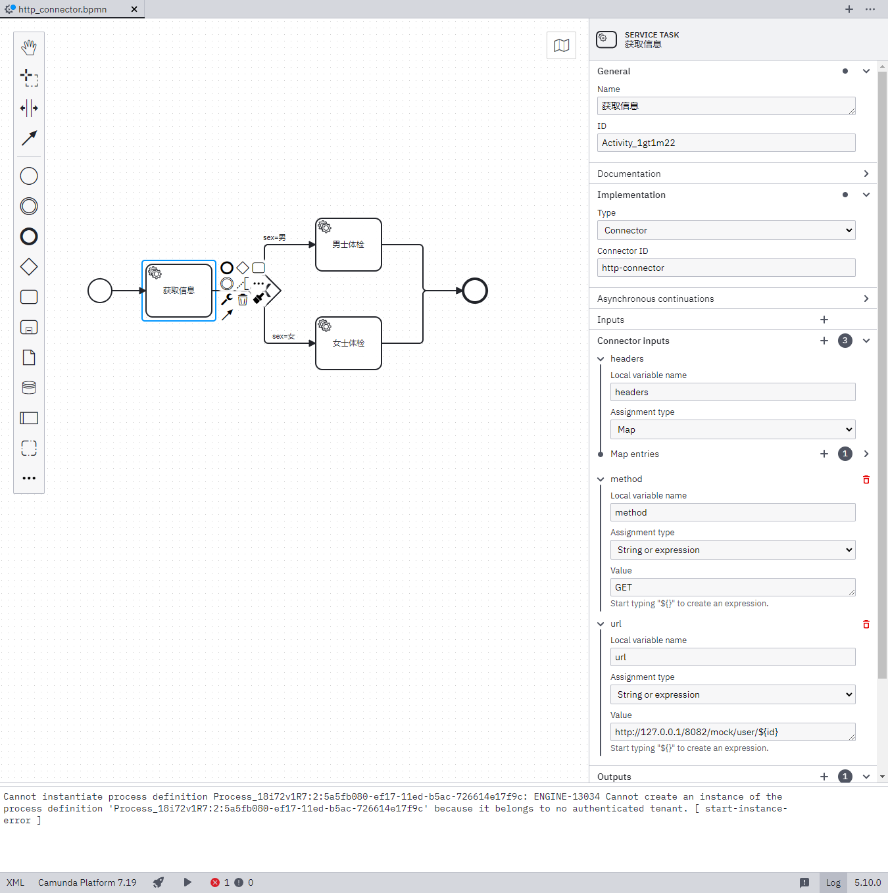
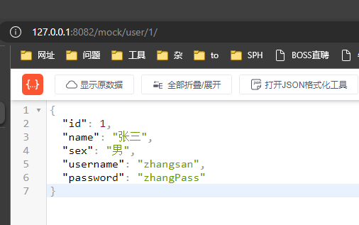
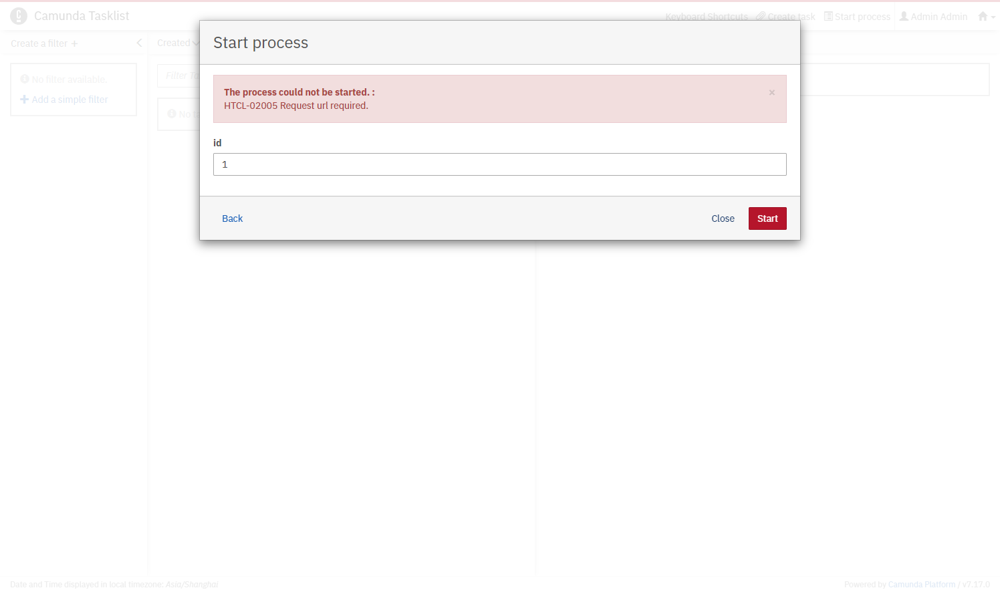

我有查看过https://forum.camunda.io/t/htcl-02007-unable-to-execute-http-request/1062 但是并没有找到解决方案



```xml
<?xml version="1.0" encoding="UTF-8"?>
<bpmn:definitions xmlns:bpmn="http://www.omg.org/spec/BPMN/20100524/MODEL" xmlns:bpmndi="http://www.omg.org/spec/BPMN/20100524/DI" xmlns:dc="http://www.omg.org/spec/DD/20100524/DC" xmlns:camunda="http://camunda.org/schema/1.0/bpmn" xmlns:xsi="http://www.w3.org/2001/XMLSchema-instance" xmlns:di="http://www.omg.org/spec/DD/20100524/DI" xmlns:modeler="http://camunda.org/schema/modeler/1.0" id="Definitions_12o97qa" targetNamespace="http://bpmn.io/schema/bpmn" exporter="Camunda Modeler" exporterVersion="5.10.0" modeler:executionPlatform="Camunda Platform" modeler:executionPlatformVersion="7.19.0">
  <bpmn:process id="Process_1gq4ays" name="httpConnector" isExecutable="true">
    <bpmn:startEvent id="StartEvent_1">
      <bpmn:extensionElements>
        <camunda:formData>
          <camunda:formField id="id" label="id" type="long" />
        </camunda:formData>
      </bpmn:extensionElements>
      <bpmn:outgoing>Flow_0v9df3z</bpmn:outgoing>
    </bpmn:startEvent>
    <bpmn:sequenceFlow id="Flow_0v9df3z" sourceRef="StartEvent_1" targetRef="Activity_1gt1m22" />
    <bpmn:serviceTask id="Activity_1gt1m22" name="获取信息">
      <bpmn:extensionElements>
        <camunda:connector>
          <camunda:inputOutput>
            <camunda:inputParameter name="headers">
              <camunda:map>
                <camunda:entry key="Content-Type">application/json</camunda:entry>
              </camunda:map>
            </camunda:inputParameter>
            <camunda:inputParameter name="method">GET</camunda:inputParameter>
            <camunda:inputParameter name="ur">http://127.0.0.1/8082/mock/user/${id}</camunda:inputParameter>
          </camunda:inputOutput>
          <camunda:connectorId>http-connector</camunda:connectorId>
        </camunda:connector>
        <camunda:inputOutput>
          <camunda:outputParameter name="sex">
            <camunda:script scriptFormat="JavaScript">var res = connector.getVariable("response");
var user = S(response);
var sex = user.prop("sex").stringValue();
sex;</camunda:script>
          </camunda:outputParameter>
        </camunda:inputOutput>
      </bpmn:extensionElements>
      <bpmn:incoming>Flow_0v9df3z</bpmn:incoming>
      <bpmn:outgoing>Flow_05cwxzv</bpmn:outgoing>
    </bpmn:serviceTask>
    <bpmn:exclusiveGateway id="Gateway_0tijdla">
      <bpmn:incoming>Flow_05cwxzv</bpmn:incoming>
      <bpmn:outgoing>Flow_15bbuws</bpmn:outgoing>
      <bpmn:outgoing>Flow_1h46hji</bpmn:outgoing>
    </bpmn:exclusiveGateway>
    <bpmn:sequenceFlow id="Flow_05cwxzv" sourceRef="Activity_1gt1m22" targetRef="Gateway_0tijdla" />
    <bpmn:sequenceFlow id="Flow_15bbuws" name="sex=男" sourceRef="Gateway_0tijdla" targetRef="Activity_0rhi87f">
      <bpmn:conditionExpression xsi:type="bpmn:tFormalExpression">${sex=='男'}</bpmn:conditionExpression>
    </bpmn:sequenceFlow>
    <bpmn:sequenceFlow id="Flow_1h46hji" name="sex=女" sourceRef="Gateway_0tijdla" targetRef="Activity_1sfw550">
      <bpmn:conditionExpression xsi:type="bpmn:tFormalExpression">${sex=='女'}</bpmn:conditionExpression>
    </bpmn:sequenceFlow>
    <bpmn:serviceTask id="Activity_1sfw550" name="女士体检" camunda:type="external" camunda:topic="female_healthy_plan">
      <bpmn:incoming>Flow_1h46hji</bpmn:incoming>
      <bpmn:outgoing>Flow_1twvbnd</bpmn:outgoing>
    </bpmn:serviceTask>
    <bpmn:serviceTask id="Activity_0rhi87f" name="男士体检" camunda:type="external" camunda:topic="male_healthy_plan">
      <bpmn:incoming>Flow_15bbuws</bpmn:incoming>
      <bpmn:outgoing>Flow_1x1e9pa</bpmn:outgoing>
    </bpmn:serviceTask>
    <bpmn:endEvent id="Event_0iec1jf">
      <bpmn:incoming>Flow_1x1e9pa</bpmn:incoming>
      <bpmn:incoming>Flow_1twvbnd</bpmn:incoming>
    </bpmn:endEvent>
    <bpmn:sequenceFlow id="Flow_1x1e9pa" sourceRef="Activity_0rhi87f" targetRef="Event_0iec1jf" />
    <bpmn:sequenceFlow id="Flow_1twvbnd" sourceRef="Activity_1sfw550" targetRef="Event_0iec1jf" />
  </bpmn:process>
  <bpmndi:BPMNDiagram id="BPMNDiagram_1">
    <bpmndi:BPMNPlane id="BPMNPlane_1" bpmnElement="Process_1gq4ays">
      <bpmndi:BPMNShape id="_BPMNShape_StartEvent_2" bpmnElement="StartEvent_1">
        <dc:Bounds x="122" y="202" width="36" height="36" />
      </bpmndi:BPMNShape>
      <bpmndi:BPMNShape id="Activity_12253ba_di" bpmnElement="Activity_1gt1m22">
        <dc:Bounds x="210" y="180" width="100" height="80" />
        <bpmndi:BPMNLabel />
      </bpmndi:BPMNShape>
      <bpmndi:BPMNShape id="Gateway_0tijdla_di" bpmnElement="Gateway_0tijdla" isMarkerVisible="true">
        <dc:Bounds x="365" y="195" width="50" height="50" />
      </bpmndi:BPMNShape>
      <bpmndi:BPMNShape id="Event_0iec1jf_di" bpmnElement="Event_0iec1jf">
        <dc:Bounds x="692" y="202" width="36" height="36" />
      </bpmndi:BPMNShape>
      <bpmndi:BPMNShape id="Activity_0qukvfj_di" bpmnElement="Activity_1sfw550">
        <dc:Bounds x="468" y="260" width="100" height="80" />
        <bpmndi:BPMNLabel />
      </bpmndi:BPMNShape>
      <bpmndi:BPMNShape id="Activity_0sgda3b_di" bpmnElement="Activity_0rhi87f">
        <dc:Bounds x="468" y="110" width="100" height="80" />
        <bpmndi:BPMNLabel />
      </bpmndi:BPMNShape>
      <bpmndi:BPMNEdge id="Flow_0v9df3z_di" bpmnElement="Flow_0v9df3z">
        <di:waypoint x="158" y="220" />
        <di:waypoint x="210" y="220" />
      </bpmndi:BPMNEdge>
      <bpmndi:BPMNEdge id="Flow_05cwxzv_di" bpmnElement="Flow_05cwxzv">
        <di:waypoint x="310" y="220" />
        <di:waypoint x="365" y="220" />
      </bpmndi:BPMNEdge>
      <bpmndi:BPMNEdge id="Flow_15bbuws_di" bpmnElement="Flow_15bbuws">
        <di:waypoint x="390" y="195" />
        <di:waypoint x="390" y="150" />
        <di:waypoint x="468" y="150" />
        <bpmndi:BPMNLabel>
          <dc:Bounds x="388" y="133" width="35" height="14" />
        </bpmndi:BPMNLabel>
      </bpmndi:BPMNEdge>
      <bpmndi:BPMNEdge id="Flow_1h46hji_di" bpmnElement="Flow_1h46hji">
        <di:waypoint x="390" y="245" />
        <di:waypoint x="390" y="300" />
        <di:waypoint x="468" y="300" />
        <bpmndi:BPMNLabel>
          <dc:Bounds x="402" y="283" width="36" height="14" />
        </bpmndi:BPMNLabel>
      </bpmndi:BPMNEdge>
      <bpmndi:BPMNEdge id="Flow_1x1e9pa_di" bpmnElement="Flow_1x1e9pa">
        <di:waypoint x="568" y="150" />
        <di:waypoint x="631" y="150" />
        <di:waypoint x="631" y="220" />
        <di:waypoint x="692" y="220" />
      </bpmndi:BPMNEdge>
      <bpmndi:BPMNEdge id="Flow_1twvbnd_di" bpmnElement="Flow_1twvbnd">
        <di:waypoint x="568" y="300" />
        <di:waypoint x="631" y="300" />
        <di:waypoint x="631" y="220" />
        <di:waypoint x="692" y="220" />
      </bpmndi:BPMNEdge>
    </bpmndi:BPMNPlane>
  </bpmndi:BPMNDiagram>
</bpmn:definitions>

```


### 在浏览器可以正常使用




```java
package com.example.demoexternalcamundajava.external.controller;

import org.camunda.bpm.engine.impl.util.JsonUtil;
import org.springframework.web.bind.annotation.GetMapping;
import org.springframework.web.bind.annotation.PathVariable;
import org.springframework.web.bind.annotation.RestController;

@RestController
public class TestController {
    @GetMapping("/mock/user/{id}")
    public String test(@PathVariable Long id) {
        if (1 == id) {
            return JsonUtil.asString(new User(1L, "张三", "男", "zhangsan", "zhangPass"));
        } else if (2 == id) {
            return JsonUtil.asString(new User(2L, "李四", "女", "lisi", "liPass"));
        } else if (3 == id) {
            return JsonUtil.asString(new User(3L, "王五", "男", "wangwu", "wangPass"));
        } else {
            return JsonUtil.asString(new User());
        }
    }
}
```


### 出现了以下问题



```
org.camunda.connect.ConnectorRequestException: HTCL-02005 Request url required.
	at org.camunda.connect.httpclient.impl.HttpConnectorLogger.requestUrlRequired(HttpConnectorLogger.java:43) ~[camunda-connect-connectors-all-1.5.2.jar:1.5.2]
	at org.camunda.connect.httpclient.impl.AbstractHttpConnector.createHttpRequestBase(AbstractHttpConnector.java:132) ~[camunda-connect-connectors-all-1.5.2.jar:1.5.2]
	at org.camunda.connect.httpclient.impl.AbstractHttpConnector.createHttpRequest(AbstractHttpConnector.java:95) ~[camunda-connect-connectors-all-1.5.2.jar:1.5.2]
	at org.camunda.connect.httpclient.impl.AbstractHttpConnector.execute(AbstractHttpConnector.java:71) ~[camunda-connect-connectors-all-1.5.2.jar:1.5.2]
	at org.camunda.connect.httpclient.impl.AbstractHttpConnector.execute(AbstractHttpConnector.java:44) ~[camunda-connect-connectors-all-1.5.2.jar:1.5.2]
	at org.camunda.connect.impl.AbstractConnectorRequest.execute(AbstractConnectorRequest.java:46) ~[camunda-connect-core-1.5.2.jar:1.5.2]
	at org.camunda.connect.plugin.impl.ServiceTaskConnectorActivityBehavior$1.call(ServiceTaskConnectorActivityBehavior.java:61) ~[camunda-engine-plugin-connect-7.17.0.jar:7.17.0]
	at org.camunda.connect.plugin.impl.ServiceTaskConnectorActivityBehavior$1.call(ServiceTaskConnectorActivityBehavior.java:55) ~[camunda-engine-plugin-connect-7.17.0.jar:7.17.0]
	at org.camunda.bpm.engine.impl.bpmn.behavior.AbstractBpmnActivityBehavior.executeWithErrorPropagation(AbstractBpmnActivityBehavior.java:90) ~[camunda-engine-7.17.0.jar:7.17.0]
	at org.camunda.connect.plugin.impl.ServiceTaskConnectorActivityBehavior.execute(ServiceTaskConnectorActivityBehavior.java:55) ~[camunda-engine-plugin-connect-7.17.0.jar:7.17.0]
	at org.camunda.bpm.engine.impl.pvm.runtime.operation.PvmAtomicOperationActivityExecute$2.callback(PvmAtomicOperationActivityExecute.java:61) ~[camunda-engine-7.17.0.jar:7.17.0]
	at org.camunda.bpm.engine.impl.pvm.runtime.operation.PvmAtomicOperationActivityExecute$2.callback(PvmAtomicOperationActivityExecute.java:50) ~[camunda-engine-7.17.0.jar:7.17.0]
	at org.camunda.bpm.engine.impl.pvm.runtime.PvmExecutionImpl.continueIfExecutionDoesNotAffectNextOperation(PvmExecutionImpl.java:2072) ~[camunda-engine-7.17.0.jar:7.17.0]
	at org.camunda.bpm.engine.impl.pvm.runtime.operation.PvmAtomicOperationActivityExecute.execute(PvmAtomicOperationActivityExecute.java:42) ~[camunda-engine-7.17.0.jar:7.17.0]
	at org.camunda.bpm.engine.impl.pvm.runtime.operation.PvmAtomicOperationActivityExecute.execute(PvmAtomicOperationActivityExecute.java:31) ~[camunda-engine-7.17.0.jar:7.17.0]
	at org.camunda.bpm.engine.impl.interceptor.AtomicOperationInvocation.execute(AtomicOperationInvocation.java:99) ~[camunda-engine-7.17.0.jar:7.17.0]
	at org.camunda.bpm.engine.impl.interceptor.CommandInvocationContext.invokeNext(CommandInvocationContext.java:131) ~[camunda-engine-7.17.0.jar:7.17.0]
	at org.camunda.bpm.engine.impl.interceptor.CommandInvocationContext.performNext(CommandInvocationContext.java:111) ~[camunda-engine-7.17.0.jar:7.17.0]
	at org.camunda.bpm.engine.impl.interceptor.CommandInvocationContext.performOperation(CommandInvocationContext.java:86) ~[camunda-engine-7.17.0.jar:7.17.0]
	at org.camunda.bpm.engine.impl.persistence.entity.ExecutionEntity.performOperation(ExecutionEntity.java:623) ~[camunda-engine-7.17.0.jar:7.17.0]
	at org.camunda.bpm.engine.impl.persistence.entity.ExecutionEntity.performOperation(ExecutionEntity.java:597) ~[camunda-engine-7.17.0.jar:7.17.0]
	at org.camunda.bpm.engine.impl.pvm.runtime.PvmExecutionImpl$6.callback(PvmExecutionImpl.java:2011) ~[camunda-engine-7.17.0.jar:7.17.0]
	at org.camunda.bpm.engine.impl.pvm.runtime.PvmExecutionImpl$6.callback(PvmExecutionImpl.java:2008) ~[camunda-engine-7.17.0.jar:7.17.0]
	at org.camunda.bpm.engine.impl.pvm.runtime.PvmExecutionImpl.continueExecutionIfNotCanceled(PvmExecutionImpl.java:2078) ~[camunda-engine-7.17.0.jar:7.17.0]
	at org.camunda.bpm.engine.impl.pvm.runtime.PvmExecutionImpl.dispatchDelayedEventsAndPerformOperation(PvmExecutionImpl.java:2027) ~[camunda-engine-7.17.0.jar:7.17.0]
	at org.camunda.bpm.engine.impl.pvm.runtime.PvmExecutionImpl.dispatchDelayedEventsAndPerformOperation(PvmExecutionImpl.java:2008) ~[camunda-engine-7.17.0.jar:7.17.0]
	at org.camunda.bpm.engine.impl.pvm.runtime.operation.PvmAtomicOperationTransitionNotifyListenerStart.eventNotificationsCompleted(PvmAtomicOperationTransitionNotifyListenerStart.java:61) ~[camunda-engine-7.17.0.jar:7.17.0]
	at org.camunda.bpm.engine.impl.pvm.runtime.operation.PvmAtomicOperationTransitionNotifyListenerStart.eventNotificationsCompleted(PvmAtomicOperationTransitionNotifyListenerStart.java:30) ~[camunda-engine-7.17.0.jar:7.17.0]
	at org.camunda.bpm.engine.impl.core.operation.AbstractEventAtomicOperation.execute(AbstractEventAtomicOperation.java:66) ~[camunda-engine-7.17.0.jar:7.17.0]
	at org.camunda.bpm.engine.impl.interceptor.AtomicOperationInvocation.execute(AtomicOperationInvocation.java:99) ~[camunda-engine-7.17.0.jar:7.17.0]
	at org.camunda.bpm.engine.impl.interceptor.CommandInvocationContext.invokeNext(CommandInvocationContext.java:131) ~[camunda-engine-7.17.0.jar:7.17.0]
	at org.camunda.bpm.engine.impl.interceptor.CommandInvocationContext.performNext(CommandInvocationContext.java:111) ~[camunda-engine-7.17.0.jar:7.17.0]
	at org.camunda.bpm.engine.impl.interceptor.CommandInvocationContext.performOperation(CommandInvocationContext.java:86) ~[camunda-engine-7.17.0.jar:7.17.0]
	at org.camunda.bpm.engine.impl.interceptor.CommandInvocationContext.performOperation(CommandInvocationContext.java:76) ~[camunda-engine-7.17.0.jar:7.17.0]
	at org.camunda.bpm.engine.impl.persistence.entity.ExecutionEntity.performOperationSync(ExecutionEntity.java:632) ~[camunda-engine-7.17.0.jar:7.17.0]
	at org.camunda.bpm.engine.impl.persistence.entity.ExecutionEntity.performOperationSync(ExecutionEntity.java:607) ~[camunda-engine-7.17.0.jar:7.17.0]
	at org.camunda.bpm.engine.impl.core.operation.AbstractEventAtomicOperation.execute(AbstractEventAtomicOperation.java:62) ~[camunda-engine-7.17.0.jar:7.17.0]
	at org.camunda.bpm.engine.impl.interceptor.AtomicOperationInvocation.execute(AtomicOperationInvocation.java:99) ~[camunda-engine-7.17.0.jar:7.17.0]
	at org.camunda.bpm.engine.impl.interceptor.CommandInvocationContext.invokeNext(CommandInvocationContext.java:131) ~[camunda-engine-7.17.0.jar:7.17.0]
	at org.camunda.bpm.engine.impl.interceptor.CommandInvocationContext.performNext(CommandInvocationContext.java:111) ~[camunda-engine-7.17.0.jar:7.17.0]
	at org.camunda.bpm.engine.impl.interceptor.CommandInvocationContext.performOperation(CommandInvocationContext.java:86) ~[camunda-engine-7.17.0.jar:7.17.0]
	at org.camunda.bpm.engine.impl.interceptor.CommandInvocationContext.performOperation(CommandInvocationContext.java:76) ~[camunda-engine-7.17.0.jar:7.17.0]
	at org.camunda.bpm.engine.impl.persistence.entity.ExecutionEntity.performOperationSync(ExecutionEntity.java:632) ~[camunda-engine-7.17.0.jar:7.17.0]
	at org.camunda.bpm.engine.impl.persistence.entity.ExecutionEntity.performOperationSync(ExecutionEntity.java:607) ~[camunda-engine-7.17.0.jar:7.17.0]
	at org.camunda.bpm.engine.impl.core.operation.AbstractEventAtomicOperation.execute(AbstractEventAtomicOperation.java:62) ~[camunda-engine-7.17.0.jar:7.17.0]
	at org.camunda.bpm.engine.impl.interceptor.AtomicOperationInvocation.execute(AtomicOperationInvocation.java:99) ~[camunda-engine-7.17.0.jar:7.17.0]
	at org.camunda.bpm.engine.impl.interceptor.CommandInvocationContext.invokeNext(CommandInvocationContext.java:131) ~[camunda-engine-7.17.0.jar:7.17.0]
	at org.camunda.bpm.engine.impl.interceptor.CommandInvocationContext.performNext(CommandInvocationContext.java:111) ~[camunda-engine-7.17.0.jar:7.17.0]
	at org.camunda.bpm.engine.impl.interceptor.CommandInvocationContext.performOperation(CommandInvocationContext.java:86) ~[camunda-engine-7.17.0.jar:7.17.0]
	at org.camunda.bpm.engine.impl.persistence.entity.ExecutionEntity.performOperation(ExecutionEntity.java:623) ~[camunda-engine-7.17.0.jar:7.17.0]
	at org.camunda.bpm.engine.impl.persistence.entity.ExecutionEntity.performOperation(ExecutionEntity.java:597) ~[camunda-engine-7.17.0.jar:7.17.0]
	at org.camunda.bpm.engine.impl.pvm.runtime.operation.PvmAtomicOperationTransitionCreateScope.scopeCreated(PvmAtomicOperationTransitionCreateScope.java:38) ~[camunda-engine-7.17.0.jar:7.17.0]
	at org.camunda.bpm.engine.impl.pvm.runtime.operation.PvmAtomicOperationCreateScope.execute(PvmAtomicOperationCreateScope.java:54) ~[camunda-engine-7.17.0.jar:7.17.0]
	at org.camunda.bpm.engine.impl.pvm.runtime.operation.PvmAtomicOperationCreateScope.execute(PvmAtomicOperationCreateScope.java:28) ~[camunda-engine-7.17.0.jar:7.17.0]
	at org.camunda.bpm.engine.impl.interceptor.AtomicOperationInvocation.execute(AtomicOperationInvocation.java:99) ~[camunda-engine-7.17.0.jar:7.17.0]
	at org.camunda.bpm.engine.impl.interceptor.CommandInvocationContext.invokeNext(CommandInvocationContext.java:131) ~[camunda-engine-7.17.0.jar:7.17.0]
	at org.camunda.bpm.engine.impl.interceptor.CommandInvocationContext.performNext(CommandInvocationContext.java:118) ~[camunda-engine-7.17.0.jar:7.17.0]
	at org.camunda.bpm.engine.impl.interceptor.CommandInvocationContext.performOperation(CommandInvocationContext.java:86) ~[camunda-engine-7.17.0.jar:7.17.0]
	at org.camunda.bpm.engine.impl.persistence.entity.ExecutionEntity.performOperation(ExecutionEntity.java:623) ~[camunda-engine-7.17.0.jar:7.17.0]
	at org.camunda.bpm.engine.impl.persistence.entity.ExecutionEntity.performOperation(ExecutionEntity.java:597) ~[camunda-engine-7.17.0.jar:7.17.0]
	at org.camunda.bpm.engine.impl.pvm.runtime.PvmExecutionImpl.start(PvmExecutionImpl.java:291) ~[camunda-engine-7.17.0.jar:7.17.0]
	at org.camunda.bpm.engine.impl.persistence.entity.ExecutionEntity.start(ExecutionEntity.java:449) ~[camunda-engine-7.17.0.jar:7.17.0]
	at org.camunda.bpm.engine.impl.pvm.runtime.PvmExecutionImpl.startWithFormProperties(PvmExecutionImpl.java:272) ~[camunda-engine-7.17.0.jar:7.17.0]
	at org.camunda.bpm.engine.impl.cmd.SubmitStartFormCmd.execute(SubmitStartFormCmd.java:73) ~[camunda-engine-7.17.0.jar:7.17.0]
	at org.camunda.bpm.engine.impl.cmd.SubmitStartFormCmd.execute(SubmitStartFormCmd.java:41) ~[camunda-engine-7.17.0.jar:7.17.0]
	at org.camunda.bpm.engine.impl.interceptor.CommandExecutorImpl.execute(CommandExecutorImpl.java:28) ~[camunda-engine-7.17.0.jar:7.17.0]
	at org.camunda.bpm.engine.impl.interceptor.CommandContextInterceptor.execute(CommandContextInterceptor.java:110) ~[camunda-engine-7.17.0.jar:7.17.0]
	at org.camunda.bpm.engine.spring.SpringTransactionInterceptor$1.doInTransaction(SpringTransactionInterceptor.java:72) ~[camunda-engine-spring-7.17.0.jar:7.17.0]
	at org.springframework.transaction.support.TransactionTemplate.execute(TransactionTemplate.java:140) ~[spring-tx-5.3.16.jar:5.3.16]
	at org.camunda.bpm.engine.spring.SpringTransactionInterceptor.execute(SpringTransactionInterceptor.java:70) ~[camunda-engine-spring-7.17.0.jar:7.17.0]
	at org.camunda.bpm.engine.impl.interceptor.ProcessApplicationContextInterceptor.execute(ProcessApplicationContextInterceptor.java:70) ~[camunda-engine-7.17.0.jar:7.17.0]
	at org.camunda.bpm.engine.impl.interceptor.CommandCounterInterceptor.execute(CommandCounterInterceptor.java:35) ~[camunda-engine-7.17.0.jar:7.17.0]
	at org.camunda.bpm.engine.impl.interceptor.LogInterceptor.execute(LogInterceptor.java:33) ~[camunda-engine-7.17.0.jar:7.17.0]
	at org.camunda.bpm.engine.impl.FormServiceImpl.submitStartForm(FormServiceImpl.java:79) ~[camunda-engine-7.17.0.jar:7.17.0]
	at org.camunda.bpm.engine.rest.sub.repository.impl.ProcessDefinitionResourceImpl.submitForm(ProcessDefinitionResourceImpl.java:193) ~[camunda-engine-rest-jaxrs2-7.17.0.jar:7.17.0]
	at java.base/jdk.internal.reflect.NativeMethodAccessorImpl.invoke0(Native Method) ~[na:na]
	at java.base/jdk.internal.reflect.NativeMethodAccessorImpl.invoke(NativeMethodAccessorImpl.java:62) ~[na:na]
	at java.base/jdk.internal.reflect.DelegatingMethodAccessorImpl.invoke(DelegatingMethodAccessorImpl.java:43) ~[na:na]
	at java.base/java.lang.reflect.Method.invoke(Method.java:566) ~[na:na]
	at org.glassfish.jersey.server.model.internal.ResourceMethodInvocationHandlerFactory.lambda$static$0(ResourceMethodInvocationHandlerFactory.java:52) ~[jersey-server-2.35.jar:na]
	at org.glassfish.jersey.server.model.internal.AbstractJavaResourceMethodDispatcher$1.run(AbstractJavaResourceMethodDispatcher.java:124) ~[jersey-server-2.35.jar:na]
	at org.glassfish.jersey.server.model.internal.AbstractJavaResourceMethodDispatcher.invoke(AbstractJavaResourceMethodDispatcher.java:167) ~[jersey-server-2.35.jar:na]
	at org.glassfish.jersey.server.model.internal.JavaResourceMethodDispatcherProvider$TypeOutInvoker.doDispatch(JavaResourceMethodDispatcherProvider.java:219) ~[jersey-server-2.35.jar:na]
	at org.glassfish.jersey.server.model.internal.AbstractJavaResourceMethodDispatcher.dispatch(AbstractJavaResourceMethodDispatcher.java:79) ~[jersey-server-2.35.jar:na]
	at org.glassfish.jersey.server.model.ResourceMethodInvoker.invoke(ResourceMethodInvoker.java:475) ~[jersey-server-2.35.jar:na]
	at org.glassfish.jersey.server.model.ResourceMethodInvoker.apply(ResourceMethodInvoker.java:397) ~[jersey-server-2.35.jar:na]
	at org.glassfish.jersey.server.model.ResourceMethodInvoker.apply(ResourceMethodInvoker.java:81) ~[jersey-server-2.35.jar:na]
	at org.glassfish.jersey.server.ServerRuntime$1.run(ServerRuntime.java:255) ~[jersey-server-2.35.jar:na]
	at org.glassfish.jersey.internal.Errors$1.call(Errors.java:248) ~[jersey-common-2.35.jar:na]
	at org.glassfish.jersey.internal.Errors$1.call(Errors.java:244) ~[jersey-common-2.35.jar:na]
	at org.glassfish.jersey.internal.Errors.process(Errors.java:292) ~[jersey-common-2.35.jar:na]
	at org.glassfish.jersey.internal.Errors.process(Errors.java:274) ~[jersey-common-2.35.jar:na]
	at org.glassfish.jersey.internal.Errors.process(Errors.java:244) ~[jersey-common-2.35.jar:na]
	at org.glassfish.jersey.process.internal.RequestScope.runInScope(RequestScope.java:265) ~[jersey-common-2.35.jar:na]
	at org.glassfish.jersey.server.ServerRuntime.process(ServerRuntime.java:234) ~[jersey-server-2.35.jar:na]
	at org.glassfish.jersey.server.ApplicationHandler.handle(ApplicationHandler.java:684) ~[jersey-server-2.35.jar:na]
	at org.glassfish.jersey.servlet.WebComponent.serviceImpl(WebComponent.java:394) ~[jersey-container-servlet-core-2.35.jar:na]
	at org.glassfish.jersey.servlet.WebComponent.service(WebComponent.java:346) ~[jersey-container-servlet-core-2.35.jar:na]
	at org.glassfish.jersey.servlet.ServletContainer.service(ServletContainer.java:366) ~[jersey-container-servlet-core-2.35.jar:na]
	at org.glassfish.jersey.servlet.ServletContainer.service(ServletContainer.java:319) ~[jersey-container-servlet-core-2.35.jar:na]
	at org.glassfish.jersey.servlet.ServletContainer.service(ServletContainer.java:205) ~[jersey-container-servlet-core-2.35.jar:na]
	at org.apache.catalina.core.ApplicationFilterChain.internalDoFilter(ApplicationFilterChain.java:227) ~[tomcat-embed-core-9.0.58.jar:9.0.58]
	at org.apache.catalina.core.ApplicationFilterChain.doFilter(ApplicationFilterChain.java:162) ~[tomcat-embed-core-9.0.58.jar:9.0.58]
	at org.apache.tomcat.websocket.server.WsFilter.doFilter(WsFilter.java:53) ~[tomcat-embed-websocket-9.0.58.jar:9.0.58]
	at org.apache.catalina.core.ApplicationFilterChain.internalDoFilter(ApplicationFilterChain.java:189) ~[tomcat-embed-core-9.0.58.jar:9.0.58]
	at org.apache.catalina.core.ApplicationFilterChain.doFilter(ApplicationFilterChain.java:162) ~[tomcat-embed-core-9.0.58.jar:9.0.58]
	at org.camunda.bpm.webapp.impl.engine.ProcessEnginesFilter.applyFilter(ProcessEnginesFilter.java:145) ~[camunda-webapp-7.17.0-classes.jar:7.17.0]
	at org.camunda.bpm.spring.boot.starter.webapp.filter.ResourceLoadingProcessEnginesFilter.applyFilter(ResourceLoadingProcessEnginesFilter.java:55) ~[camunda-bpm-spring-boot-starter-webapp-core-7.17.0.jar:7.17.0]
	at org.camunda.bpm.webapp.impl.filter.AbstractTemplateFilter.doFilter(AbstractTemplateFilter.java:58) ~[camunda-webapp-7.17.0-classes.jar:7.17.0]
	at org.camunda.bpm.spring.boot.starter.webapp.filter.LazyDelegateFilter.doFilter(LazyDelegateFilter.java:60) ~[camunda-bpm-spring-boot-starter-webapp-core-7.17.0.jar:7.17.0]
	at org.apache.catalina.core.ApplicationFilterChain.internalDoFilter(ApplicationFilterChain.java:189) ~[tomcat-embed-core-9.0.58.jar:9.0.58]
	at org.apache.catalina.core.ApplicationFilterChain.doFilter(ApplicationFilterChain.java:162) ~[tomcat-embed-core-9.0.58.jar:9.0.58]
	at org.camunda.bpm.webapp.impl.security.filter.headersec.HttpHeaderSecurityFilter.doFilter(HttpHeaderSecurityFilter.java:89) ~[camunda-webapp-7.17.0-classes.jar:7.17.0]
	at org.apache.catalina.core.ApplicationFilterChain.internalDoFilter(ApplicationFilterChain.java:189) ~[tomcat-embed-core-9.0.58.jar:9.0.58]
	at org.apache.catalina.core.ApplicationFilterChain.doFilter(ApplicationFilterChain.java:162) ~[tomcat-embed-core-9.0.58.jar:9.0.58]
	at org.camunda.bpm.webapp.impl.security.filter.SessionCookieFilter.doFilter(SessionCookieFilter.java:52) ~[camunda-webapp-7.17.0-classes.jar:7.17.0]
	at org.apache.catalina.core.ApplicationFilterChain.internalDoFilter(ApplicationFilterChain.java:189) ~[tomcat-embed-core-9.0.58.jar:9.0.58]
	at org.apache.catalina.core.ApplicationFilterChain.doFilter(ApplicationFilterChain.java:162) ~[tomcat-embed-core-9.0.58.jar:9.0.58]
	at org.camunda.bpm.webapp.impl.security.filter.CsrfPreventionFilter.doFilter(CsrfPreventionFilter.java:171) ~[camunda-webapp-7.17.0-classes.jar:7.17.0]
	at org.apache.catalina.core.ApplicationFilterChain.internalDoFilter(ApplicationFilterChain.java:189) ~[tomcat-embed-core-9.0.58.jar:9.0.58]
	at org.apache.catalina.core.ApplicationFilterChain.doFilter(ApplicationFilterChain.java:162) ~[tomcat-embed-core-9.0.58.jar:9.0.58]
	at org.camunda.bpm.webapp.impl.security.filter.SecurityFilter.doFilterSecure(SecurityFilter.java:73) ~[camunda-webapp-7.17.0-classes.jar:7.17.0]
	at org.camunda.bpm.webapp.impl.security.filter.SecurityFilter.doFilter(SecurityFilter.java:57) ~[camunda-webapp-7.17.0-classes.jar:7.17.0]
	at org.camunda.bpm.spring.boot.starter.webapp.filter.LazyDelegateFilter.doFilter(LazyDelegateFilter.java:60) ~[camunda-bpm-spring-boot-starter-webapp-core-7.17.0.jar:7.17.0]
	at org.apache.catalina.core.ApplicationFilterChain.internalDoFilter(ApplicationFilterChain.java:189) ~[tomcat-embed-core-9.0.58.jar:9.0.58]
	at org.apache.catalina.core.ApplicationFilterChain.doFilter(ApplicationFilterChain.java:162) ~[tomcat-embed-core-9.0.58.jar:9.0.58]
	at org.camunda.bpm.webapp.impl.security.auth.AuthenticationFilter$1.execute(AuthenticationFilter.java:62) ~[camunda-webapp-7.17.0-classes.jar:7.17.0]
	at org.camunda.bpm.webapp.impl.security.auth.AuthenticationFilter$1.execute(AuthenticationFilter.java:60) ~[camunda-webapp-7.17.0-classes.jar:7.17.0]
	at org.camunda.bpm.webapp.impl.security.SecurityActions.runWithAuthentications(SecurityActions.java:44) ~[camunda-webapp-7.17.0-classes.jar:7.17.0]
	at org.camunda.bpm.webapp.impl.security.auth.AuthenticationFilter.doFilter(AuthenticationFilter.java:60) ~[camunda-webapp-7.17.0-classes.jar:7.17.0]
	at org.apache.catalina.core.ApplicationFilterChain.internalDoFilter(ApplicationFilterChain.java:189) ~[tomcat-embed-core-9.0.58.jar:9.0.58]
	at org.apache.catalina.core.ApplicationFilterChain.doFilter(ApplicationFilterChain.java:162) ~[tomcat-embed-core-9.0.58.jar:9.0.58]
	at org.springframework.web.filter.RequestContextFilter.doFilterInternal(RequestContextFilter.java:100) ~[spring-web-5.3.16.jar:5.3.16]
	at org.springframework.web.filter.OncePerRequestFilter.doFilter(OncePerRequestFilter.java:117) ~[spring-web-5.3.16.jar:5.3.16]
	at org.apache.catalina.core.ApplicationFilterChain.internalDoFilter(ApplicationFilterChain.java:189) ~[tomcat-embed-core-9.0.58.jar:9.0.58]
	at org.apache.catalina.core.ApplicationFilterChain.doFilter(ApplicationFilterChain.java:162) ~[tomcat-embed-core-9.0.58.jar:9.0.58]
	at org.springframework.web.filter.FormContentFilter.doFilterInternal(FormContentFilter.java:93) ~[spring-web-5.3.16.jar:5.3.16]
	at org.springframework.web.filter.OncePerRequestFilter.doFilter(OncePerRequestFilter.java:117) ~[spring-web-5.3.16.jar:5.3.16]
	at org.apache.catalina.core.ApplicationFilterChain.internalDoFilter(ApplicationFilterChain.java:189) ~[tomcat-embed-core-9.0.58.jar:9.0.58]
	at org.apache.catalina.core.ApplicationFilterChain.doFilter(ApplicationFilterChain.java:162) ~[tomcat-embed-core-9.0.58.jar:9.0.58]
	at org.springframework.web.filter.CharacterEncodingFilter.doFilterInternal(CharacterEncodingFilter.java:201) ~[spring-web-5.3.16.jar:5.3.16]
	at org.springframework.web.filter.OncePerRequestFilter.doFilter(OncePerRequestFilter.java:117) ~[spring-web-5.3.16.jar:5.3.16]
	at org.apache.catalina.core.ApplicationFilterChain.internalDoFilter(ApplicationFilterChain.java:189) ~[tomcat-embed-core-9.0.58.jar:9.0.58]
	at org.apache.catalina.core.ApplicationFilterChain.doFilter(ApplicationFilterChain.java:162) ~[tomcat-embed-core-9.0.58.jar:9.0.58]
	at org.apache.catalina.core.StandardWrapperValve.invoke(StandardWrapperValve.java:197) ~[tomcat-embed-core-9.0.58.jar:9.0.58]
	at org.apache.catalina.core.StandardContextValve.invoke(StandardContextValve.java:97) ~[tomcat-embed-core-9.0.58.jar:9.0.58]
	at org.apache.catalina.authenticator.AuthenticatorBase.invoke(AuthenticatorBase.java:540) ~[tomcat-embed-core-9.0.58.jar:9.0.58]
	at org.apache.catalina.core.StandardHostValve.invoke(StandardHostValve.java:135) ~[tomcat-embed-core-9.0.58.jar:9.0.58]
	at org.apache.catalina.valves.ErrorReportValve.invoke(ErrorReportValve.java:92) ~[tomcat-embed-core-9.0.58.jar:9.0.58]
	at org.apache.catalina.core.StandardEngineValve.invoke(StandardEngineValve.java:78) ~[tomcat-embed-core-9.0.58.jar:9.0.58]
	at org.apache.catalina.connector.CoyoteAdapter.service(CoyoteAdapter.java:359) ~[tomcat-embed-core-9.0.58.jar:9.0.58]
	at org.apache.coyote.http11.Http11Processor.service(Http11Processor.java:399) ~[tomcat-embed-core-9.0.58.jar:9.0.58]
	at org.apache.coyote.AbstractProcessorLight.process(AbstractProcessorLight.java:65) ~[tomcat-embed-core-9.0.58.jar:9.0.58]
	at org.apache.coyote.AbstractProtocol$ConnectionHandler.process(AbstractProtocol.java:889) ~[tomcat-embed-core-9.0.58.jar:9.0.58]
	at org.apache.tomcat.util.net.NioEndpoint$SocketProcessor.doRun(NioEndpoint.java:1735) ~[tomcat-embed-core-9.0.58.jar:9.0.58]
	at org.apache.tomcat.util.net.SocketProcessorBase.run(SocketProcessorBase.java:49) ~[tomcat-embed-core-9.0.58.jar:9.0.58]
	at org.apache.tomcat.util.threads.ThreadPoolExecutor.runWorker(ThreadPoolExecutor.java:1191) ~[tomcat-embed-core-9.0.58.jar:9.0.58]
	at org.apache.tomcat.util.threads.ThreadPoolExecutor$Worker.run(ThreadPoolExecutor.java:659) ~[tomcat-embed-core-9.0.58.jar:9.0.58]
	at org.apache.tomcat.util.threads.TaskThread$WrappingRunnable.run(TaskThread.java:61) ~[tomcat-embed-core-9.0.58.jar:9.0.58]
	at java.base/java.lang.Thread.run(Thread.java:834) ~[na:na]

2023-05-10 19:16:47.384  WARN 24708 --- [nio-8080-exec-3] org.camunda.bpm.engine.rest.exception    : ENGINE-REST-HTTP500 org.camunda.connect.ConnectorRequestException: HTCL-02005 Request url required.
	at org.camunda.connect.httpclient.impl.HttpConnectorLogger.requestUrlRequired(HttpConnectorLogger.java:43)
	at org.camunda.connect.httpclient.impl.AbstractHttpConnector.createHttpRequestBase(AbstractHttpConnector.java:132)
	at org.camunda.connect.httpclient.impl.AbstractHttpConnector.createHttpRequest(AbstractHttpConnector.java:95)
	at org.camunda.connect.httpclient.impl.AbstractHttpConnector.execute(AbstractHttpConnector.java:71)
	at org.camunda.connect.httpclient.impl.AbstractHttpConnector.execute(AbstractHttpConnector.java:44)
	at org.camunda.connect.impl.AbstractConnectorRequest.execute(AbstractConnectorRequest.java:46)
	at org.camunda.connect.plugin.impl.ServiceTaskConnectorActivityBehavior$1.call(ServiceTaskConnectorActivityBehavior.java:61)
	at org.camunda.connect.plugin.impl.ServiceTaskConnectorActivityBehavior$1.call(ServiceTaskConnectorActivityBehavior.java:55)
	at org.camunda.bpm.engine.impl.bpmn.behavior.AbstractBpmnActivityBehavior.executeWithErrorPropagation(AbstractBpmnActivityBehavior.java:90)
	at org.camunda.connect.plugin.impl.ServiceTaskConnectorActivityBehavior.execute(ServiceTaskConnectorActivityBehavior.java:55)
	at org.camunda.bpm.engine.impl.pvm.runtime.operation.PvmAtomicOperationActivityExecute$2.callback(PvmAtomicOperationActivityExecute.java:61)
	at org.camunda.bpm.engine.impl.pvm.runtime.operation.PvmAtomicOperationActivityExecute$2.callback(PvmAtomicOperationActivityExecute.java:50)
	at org.camunda.bpm.engine.impl.pvm.runtime.PvmExecutionImpl.continueIfExecutionDoesNotAffectNextOperation(PvmExecutionImpl.java:2072)
	at org.camunda.bpm.engine.impl.pvm.runtime.operation.PvmAtomicOperationActivityExecute.execute(PvmAtomicOperationActivityExecute.java:42)
	at org.camunda.bpm.engine.impl.pvm.runtime.operation.PvmAtomicOperationActivityExecute.execute(PvmAtomicOperationActivityExecute.java:31)
	at org.camunda.bpm.engine.impl.interceptor.AtomicOperationInvocation.execute(AtomicOperationInvocation.java:99)
	at org.camunda.bpm.engine.impl.interceptor.CommandInvocationContext.invokeNext(CommandInvocationContext.java:131)
	at org.camunda.bpm.engine.impl.interceptor.CommandInvocationContext.performNext(CommandInvocationContext.java:111)
	at org.camunda.bpm.engine.impl.interceptor.CommandInvocationContext.performOperation(CommandInvocationContext.java:86)
	at org.camunda.bpm.engine.impl.persistence.entity.ExecutionEntity.performOperation(ExecutionEntity.java:623)
	at org.camunda.bpm.engine.impl.persistence.entity.ExecutionEntity.performOperation(ExecutionEntity.java:597)
	at org.camunda.bpm.engine.impl.pvm.runtime.PvmExecutionImpl$6.callback(PvmExecutionImpl.java:2011)
	at org.camunda.bpm.engine.impl.pvm.runtime.PvmExecutionImpl$6.callback(PvmExecutionImpl.java:2008)
	at org.camunda.bpm.engine.impl.pvm.runtime.PvmExecutionImpl.continueExecutionIfNotCanceled(PvmExecutionImpl.java:2078)
	at org.camunda.bpm.engine.impl.pvm.runtime.PvmExecutionImpl.dispatchDelayedEventsAndPerformOperation(PvmExecutionImpl.java:2027)
	at org.camunda.bpm.engine.impl.pvm.runtime.PvmExecutionImpl.dispatchDelayedEventsAndPerformOperation(PvmExecutionImpl.java:2008)
	at org.camunda.bpm.engine.impl.pvm.runtime.operation.PvmAtomicOperationTransitionNotifyListenerStart.eventNotificationsCompleted(PvmAtomicOperationTransitionNotifyListenerStart.java:61)
	at org.camunda.bpm.engine.impl.pvm.runtime.operation.PvmAtomicOperationTransitionNotifyListenerStart.eventNotificationsCompleted(PvmAtomicOperationTransitionNotifyListenerStart.java:30)
	at org.camunda.bpm.engine.impl.core.operation.AbstractEventAtomicOperation.execute(AbstractEventAtomicOperation.java:66)
	at org.camunda.bpm.engine.impl.interceptor.AtomicOperationInvocation.execute(AtomicOperationInvocation.java:99)
	at org.camunda.bpm.engine.impl.interceptor.CommandInvocationContext.invokeNext(CommandInvocationContext.java:131)
	at org.camunda.bpm.engine.impl.interceptor.CommandInvocationContext.performNext(CommandInvocationContext.java:111)
	at org.camunda.bpm.engine.impl.interceptor.CommandInvocationContext.performOperation(CommandInvocationContext.java:86)
	at org.camunda.bpm.engine.impl.interceptor.CommandInvocationContext.performOperation(CommandInvocationContext.java:76)
	at org.camunda.bpm.engine.impl.persistence.entity.ExecutionEntity.performOperationSync(ExecutionEntity.java:632)
	at org.camunda.bpm.engine.impl.persistence.entity.ExecutionEntity.performOperationSync(ExecutionEntity.java:607)
	at org.camunda.bpm.engine.impl.core.operation.AbstractEventAtomicOperation.execute(AbstractEventAtomicOperation.java:62)
	at org.camunda.bpm.engine.impl.interceptor.AtomicOperationInvocation.execute(AtomicOperationInvocation.java:99)
	at org.camunda.bpm.engine.impl.interceptor.CommandInvocationContext.invokeNext(CommandInvocationContext.java:131)
	at org.camunda.bpm.engine.impl.interceptor.CommandInvocationContext.performNext(CommandInvocationContext.java:111)
	at org.camunda.bpm.engine.impl.interceptor.CommandInvocationContext.performOperation(CommandInvocationContext.java:86)
	at org.camunda.bpm.engine.impl.interceptor.CommandInvocationContext.performOperation(CommandInvocationContext.java:76)
	at org.camunda.bpm.engine.impl.persistence.entity.ExecutionEntity.performOperationSync(ExecutionEntity.java:632)
	at org.camunda.bpm.engine.impl.persistence.entity.ExecutionEntity.performOperationSync(ExecutionEntity.java:607)
	at org.camunda.bpm.engine.impl.core.operation.AbstractEventAtomicOperation.execute(AbstractEventAtomicOperation.java:62)
	at org.camunda.bpm.engine.impl.interceptor.AtomicOperationInvocation.execute(AtomicOperationInvocation.java:99)
	at org.camunda.bpm.engine.impl.interceptor.CommandInvocationContext.invokeNext(CommandInvocationContext.java:131)
	at org.camunda.bpm.engine.impl.interceptor.CommandInvocationContext.performNext(CommandInvocationContext.java:111)
	at org.camunda.bpm.engine.impl.interceptor.CommandInvocationContext.performOperation(CommandInvocationContext.java:86)
	at org.camunda.bpm.engine.impl.persistence.entity.ExecutionEntity.performOperation(ExecutionEntity.java:623)
	at org.camunda.bpm.engine.impl.persistence.entity.ExecutionEntity.performOperation(ExecutionEntity.java:597)
	at org.camunda.bpm.engine.impl.pvm.runtime.operation.PvmAtomicOperationTransitionCreateScope.scopeCreated(PvmAtomicOperationTransitionCreateScope.java:38)
	at org.camunda.bpm.engine.impl.pvm.runtime.operation.PvmAtomicOperationCreateScope.execute(PvmAtomicOperationCreateScope.java:54)
	at org.camunda.bpm.engine.impl.pvm.runtime.operation.PvmAtomicOperationCreateScope.execute(PvmAtomicOperationCreateScope.java:28)
	at org.camunda.bpm.engine.impl.interceptor.AtomicOperationInvocation.execute(AtomicOperationInvocation.java:99)
	at org.camunda.bpm.engine.impl.interceptor.CommandInvocationContext.invokeNext(CommandInvocationContext.java:131)
	at org.camunda.bpm.engine.impl.interceptor.CommandInvocationContext.performNext(CommandInvocationContext.java:118)
	at org.camunda.bpm.engine.impl.interceptor.CommandInvocationContext.performOperation(CommandInvocationContext.java:86)
	at org.camunda.bpm.engine.impl.persistence.entity.ExecutionEntity.performOperation(ExecutionEntity.java:623)
	at org.camunda.bpm.engine.impl.persistence.entity.ExecutionEntity.performOperation(ExecutionEntity.java:597)
	at org.camunda.bpm.engine.impl.pvm.runtime.PvmExecutionImpl.start(PvmExecutionImpl.java:291)
	at org.camunda.bpm.engine.impl.persistence.entity.ExecutionEntity.start(ExecutionEntity.java:449)
	at org.camunda.bpm.engine.impl.pvm.runtime.PvmExecutionImpl.startWithFormProperties(PvmExecutionImpl.java:272)
	at org.camunda.bpm.engine.impl.cmd.SubmitStartFormCmd.execute(SubmitStartFormCmd.java:73)
	at org.camunda.bpm.engine.impl.cmd.SubmitStartFormCmd.execute(SubmitStartFormCmd.java:41)
	at org.camunda.bpm.engine.impl.interceptor.CommandExecutorImpl.execute(CommandExecutorImpl.java:28)
	at org.camunda.bpm.engine.impl.interceptor.CommandContextInterceptor.execute(CommandContextInterceptor.java:110)
	at org.camunda.bpm.engine.spring.SpringTransactionInterceptor$1.doInTransaction(SpringTransactionInterceptor.java:72)
	at org.springframework.transaction.support.TransactionTemplate.execute(TransactionTemplate.java:140)
	at org.camunda.bpm.engine.spring.SpringTransactionInterceptor.execute(SpringTransactionInterceptor.java:70)
	at org.camunda.bpm.engine.impl.interceptor.ProcessApplicationContextInterceptor.execute(ProcessApplicationContextInterceptor.java:70)
	at org.camunda.bpm.engine.impl.interceptor.CommandCounterInterceptor.execute(CommandCounterInterceptor.java:35)
	at org.camunda.bpm.engine.impl.interceptor.LogInterceptor.execute(LogInterceptor.java:33)
	at org.camunda.bpm.engine.impl.FormServiceImpl.submitStartForm(FormServiceImpl.java:79)
	at org.camunda.bpm.engine.rest.sub.repository.impl.ProcessDefinitionResourceImpl.submitForm(ProcessDefinitionResourceImpl.java:193)
	at java.base/jdk.internal.reflect.NativeMethodAccessorImpl.invoke0(Native Method)
	at java.base/jdk.internal.reflect.NativeMethodAccessorImpl.invoke(NativeMethodAccessorImpl.java:62)
	at java.base/jdk.internal.reflect.DelegatingMethodAccessorImpl.invoke(DelegatingMethodAccessorImpl.java:43)
	at java.base/java.lang.reflect.Method.invoke(Method.java:566)
	at org.glassfish.jersey.server.model.internal.ResourceMethodInvocationHandlerFactory.lambda$static$0(ResourceMethodInvocationHandlerFactory.java:52)
	at org.glassfish.jersey.server.model.internal.AbstractJavaResourceMethodDispatcher$1.run(AbstractJavaResourceMethodDispatcher.java:124)
	at org.glassfish.jersey.server.model.internal.AbstractJavaResourceMethodDispatcher.invoke(AbstractJavaResourceMethodDispatcher.java:167)
	at org.glassfish.jersey.server.model.internal.JavaResourceMethodDispatcherProvider$TypeOutInvoker.doDispatch(JavaResourceMethodDispatcherProvider.java:219)
	at org.glassfish.jersey.server.model.internal.AbstractJavaResourceMethodDispatcher.dispatch(AbstractJavaResourceMethodDispatcher.java:79)
	at org.glassfish.jersey.server.model.ResourceMethodInvoker.invoke(ResourceMethodInvoker.java:475)
	at org.glassfish.jersey.server.model.ResourceMethodInvoker.apply(ResourceMethodInvoker.java:397)
	at org.glassfish.jersey.server.model.ResourceMethodInvoker.apply(ResourceMethodInvoker.java:81)
	at org.glassfish.jersey.server.ServerRuntime$1.run(ServerRuntime.java:255)
	at org.glassfish.jersey.internal.Errors$1.call(Errors.java:248)
	at org.glassfish.jersey.internal.Errors$1.call(Errors.java:244)
	at org.glassfish.jersey.internal.Errors.process(Errors.java:292)
	at org.glassfish.jersey.internal.Errors.process(Errors.java:274)
	at org.glassfish.jersey.internal.Errors.process(Errors.java:244)
	at org.glassfish.jersey.process.internal.RequestScope.runInScope(RequestScope.java:265)
	at org.glassfish.jersey.server.ServerRuntime.process(ServerRuntime.java:234)
	at org.glassfish.jersey.server.ApplicationHandler.handle(ApplicationHandler.java:684)
	at org.glassfish.jersey.servlet.WebComponent.serviceImpl(WebComponent.java:394)
	at org.glassfish.jersey.servlet.WebComponent.service(WebComponent.java:346)
	at org.glassfish.jersey.servlet.ServletContainer.service(ServletContainer.java:366)
	at org.glassfish.jersey.servlet.ServletContainer.service(ServletContainer.java:319)
	at org.glassfish.jersey.servlet.ServletContainer.service(ServletContainer.java:205)
	at org.apache.catalina.core.ApplicationFilterChain.internalDoFilter(ApplicationFilterChain.java:227)
	at org.apache.catalina.core.ApplicationFilterChain.doFilter(ApplicationFilterChain.java:162)
	at org.apache.tomcat.websocket.server.WsFilter.doFilter(WsFilter.java:53)
	at org.apache.catalina.core.ApplicationFilterChain.internalDoFilter(ApplicationFilterChain.java:189)
	at org.apache.catalina.core.ApplicationFilterChain.doFilter(ApplicationFilterChain.java:162)
	at org.camunda.bpm.webapp.impl.engine.ProcessEnginesFilter.applyFilter(ProcessEnginesFilter.java:145)
	at org.camunda.bpm.spring.boot.starter.webapp.filter.ResourceLoadingProcessEnginesFilter.applyFilter(ResourceLoadingProcessEnginesFilter.java:55)
	at org.camunda.bpm.webapp.impl.filter.AbstractTemplateFilter.doFilter(AbstractTemplateFilter.java:58)
	at org.camunda.bpm.spring.boot.starter.webapp.filter.LazyDelegateFilter.doFilter(LazyDelegateFilter.java:60)
	at org.apache.catalina.core.ApplicationFilterChain.internalDoFilter(ApplicationFilterChain.java:189)
	at org.apache.catalina.core.ApplicationFilterChain.doFilter(ApplicationFilterChain.java:162)
	at org.camunda.bpm.webapp.impl.security.filter.headersec.HttpHeaderSecurityFilter.doFilter(HttpHeaderSecurityFilter.java:89)
	at org.apache.catalina.core.ApplicationFilterChain.internalDoFilter(ApplicationFilterChain.java:189)
	at org.apache.catalina.core.ApplicationFilterChain.doFilter(ApplicationFilterChain.java:162)
	at org.camunda.bpm.webapp.impl.security.filter.SessionCookieFilter.doFilter(SessionCookieFilter.java:52)
	at org.apache.catalina.core.ApplicationFilterChain.internalDoFilter(ApplicationFilterChain.java:189)
	at org.apache.catalina.core.ApplicationFilterChain.doFilter(ApplicationFilterChain.java:162)
	at org.camunda.bpm.webapp.impl.security.filter.CsrfPreventionFilter.doFilter(CsrfPreventionFilter.java:171)
	at org.apache.catalina.core.ApplicationFilterChain.internalDoFilter(ApplicationFilterChain.java:189)
	at org.apache.catalina.core.ApplicationFilterChain.doFilter(ApplicationFilterChain.java:162)
	at org.camunda.bpm.webapp.impl.security.filter.SecurityFilter.doFilterSecure(SecurityFilter.java:73)
	at org.camunda.bpm.webapp.impl.security.filter.SecurityFilter.doFilter(SecurityFilter.java:57)
	at org.camunda.bpm.spring.boot.starter.webapp.filter.LazyDelegateFilter.doFilter(LazyDelegateFilter.java:60)
	at org.apache.catalina.core.ApplicationFilterChain.internalDoFilter(ApplicationFilterChain.java:189)
	at org.apache.catalina.core.ApplicationFilterChain.doFilter(ApplicationFilterChain.java:162)
	at org.camunda.bpm.webapp.impl.security.auth.AuthenticationFilter$1.execute(AuthenticationFilter.java:62)
	at org.camunda.bpm.webapp.impl.security.auth.AuthenticationFilter$1.execute(AuthenticationFilter.java:60)
	at org.camunda.bpm.webapp.impl.security.SecurityActions.runWithAuthentications(SecurityActions.java:44)
	at org.camunda.bpm.webapp.impl.security.auth.AuthenticationFilter.doFilter(AuthenticationFilter.java:60)
	at org.apache.catalina.core.ApplicationFilterChain.internalDoFilter(ApplicationFilterChain.java:189)
	at org.apache.catalina.core.ApplicationFilterChain.doFilter(ApplicationFilterChain.java:162)
	at org.springframework.web.filter.RequestContextFilter.doFilterInternal(RequestContextFilter.java:100)
	at org.springframework.web.filter.OncePerRequestFilter.doFilter(OncePerRequestFilter.java:117)
	at org.apache.catalina.core.ApplicationFilterChain.internalDoFilter(ApplicationFilterChain.java:189)
	at org.apache.catalina.core.ApplicationFilterChain.doFilter(ApplicationFilterChain.java:162)
	at org.springframework.web.filter.FormContentFilter.doFilterInternal(FormContentFilter.java:93)
	at org.springframework.web.filter.OncePerRequestFilter.doFilter(OncePerRequestFilter.java:117)
	at org.apache.catalina.core.ApplicationFilterChain.internalDoFilter(ApplicationFilterChain.java:189)
	at org.apache.catalina.core.ApplicationFilterChain.doFilter(ApplicationFilterChain.java:162)
	at org.springframework.web.filter.CharacterEncodingFilter.doFilterInternal(CharacterEncodingFilter.java:201)
	at org.springframework.web.filter.OncePerRequestFilter.doFilter(OncePerRequestFilter.java:117)
	at org.apache.catalina.core.ApplicationFilterChain.internalDoFilter(ApplicationFilterChain.java:189)
	at org.apache.catalina.core.ApplicationFilterChain.doFilter(ApplicationFilterChain.java:162)
	at org.apache.catalina.core.StandardWrapperValve.invoke(StandardWrapperValve.java:197)
	at org.apache.catalina.core.StandardContextValve.invoke(StandardContextValve.java:97)
	at org.apache.catalina.authenticator.AuthenticatorBase.invoke(AuthenticatorBase.java:540)
	at org.apache.catalina.core.StandardHostValve.invoke(StandardHostValve.java:135)
	at org.apache.catalina.valves.ErrorReportValve.invoke(ErrorReportValve.java:92)
	at org.apache.catalina.core.StandardEngineValve.invoke(StandardEngineValve.java:78)
	at org.apache.catalina.connector.CoyoteAdapter.service(CoyoteAdapter.java:359)
	at org.apache.coyote.http11.Http11Processor.service(Http11Processor.java:399)
	at org.apache.coyote.AbstractProcessorLight.process(AbstractProcessorLight.java:65)
	at org.apache.coyote.AbstractProtocol$ConnectionHandler.process(AbstractProtocol.java:889)
	at org.apache.tomcat.util.net.NioEndpoint$SocketProcessor.doRun(NioEndpoint.java:1735)
	at org.apache.tomcat.util.net.SocketProcessorBase.run(SocketProcessorBase.java:49)
	at org.apache.tomcat.util.threads.ThreadPoolExecutor.runWorker(ThreadPoolExecutor.java:1191)
	at org.apache.tomcat.util.threads.ThreadPoolExecutor$Worker.run(ThreadPoolExecutor.java:659)
	at org.apache.tomcat.util.threads.TaskThread$WrappingRunnable.run(TaskThread.java:61)
	at java.base/java.lang.Thread.run(Thread.java:834)
```

感谢您的回复
